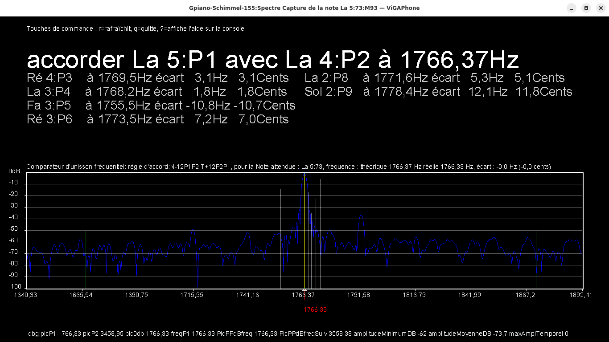

## FR ViGAWorld - ViGAPhone : [présentation en français, voir plus loin](https://github.com/ViGAWorld-FR/ViGAWorld-ViGAPhone/tree/main#fr-vigaphone)
## EN ViGAWorld - ViGAPhone : because music is a world of sharing !

**ViGAPhone** is a realistic musical instrument synthesizer and a powerful tool for piano tuners and technicians.

## 🎹 Overview

ViGAPhone is a realistic synthesis program for Linux or Windows computers, optionally used with a MIDI keyboard. It is designed for performing musicians, professional tuners, and occasional hobbyists.

If you're familiar with Pianoteq (Modartt), Ivory (Synthogy), or Kontakt (Native Instruments), you already have some insight into physical modeling or sampling-based synthesis.

ViGAPhone is based on physical modeling synthesis of string, percussion, or wind instruments, similar to Pianoteq, but with far more possibilities offered to the user. The first version was developed around the piano instrument, but it already includes everything needed to emulate other instruments to create entirely new ones.

It is already the world’s most advanced software combining sound synthesis and elecronic tuning assistance for pianos and all other instruments.

- ViGAPhone high precision any instrument and piano electronic tuner / accordeur électronique haute précision de piano et tout instrument

- ViGAPhone piano's inharmonicity acquisition

- ViGAPhone piano's timbre acquisition and modeling / Acquisition et modélisation du timbre du piano

---

## 🎵 Features for Musicians

- Realistic, rich, deep, and expressive sound with touch-sensitive timbre, offering everything needed to enjoy performing or composing
- Emulate any existing instrument,  such as replicating a specific acoustic piano
- Create entirely new instruments with original sounds
- Fully customizable instrument and synthesis engine
- Share compact configuration files (just a few kilobytes) that encode the "DNA" of a concert piano
- Discover and preserve the best tuning methods for your real instrument, tailored to the style of music being played
- Request a professional tuner to apply a specific and consistent tuning, ideal for concert halls or touring musicians

---

## 🛠️ Features for Piano Tuners

- Pedagogical tool for learning and validating piano tuning skills
- Train your ear to recognize harmonic partials and their ranks
- Practice tuning safely without risk to real instruments
- Analyze and replicate the characteristics of an acoustic piano, including inharmonicity
- Define the tuning method in a few lines using a simple grammar that establishes relationships between notes
- Propose and test multiple tunings in real-time before applying them to the actual instrument
- Use perfect unison with ViGAPhone’s output to tune real instruments quickly and precisely
- Perform spectral analysis to detect unwanted resonances or harmonization issues

---

## ⚙️ Technical Highlights
ViGAPhone is built on the ADSR model, describing the four phases of a musical note’s life. Combined with an automatic spectral analysis engine and waveform-based audio rendering, musicians can define ADSR parameters and recreate the sound of a real piano in minutes—so precisely that it becomes indistinguishable from the original.

It features:
- A keyboard-driven text interface: streamlined and highly efficient, ideal for professionals
- A graphical interface for real-time sound analysis, timbre reproduction, and ultra-precise piano or any instrument tuning
- An extremely compact executable size—where design quality and code efficiency truly matter
- runing on Linux with jack/alsa as on Windows10 and more
- The audio engine is exceptionally powerful—arguably the most efficient in the world. It can run on computers that are 15 years old and handle tens of thousands of waves in real time without overloading the system. It performs pure additive synthesis using sine waves, or blends them with complex computed or sampled waveforms, offering infinite creative possibilities and an extreme sonic richness.

---

## 🔐 Licensing

ViGAPhone is distributed as a binary-only application. No source code is provided.

To use ViGAPhone, you must obtain a license from [https://vigaworld.com](https://vigaworld.com). Each license is linked to a registered user and their system. Redistribution, reverse engineering, or modification is strictly prohibited.

---

## 📫 Contact

For licensing or support inquiries:

- Website: [https://vigaworld.com](https://vigaworld.com)  
- Email: [contactnotcopythis@vigaworld.com]

----------------------------------------------------------------------------------------------------------------------

## FR ViGAWorld - ViGAPhone : parce que la musique est un monde de partage !

**ViGAPhone** est un synthétiseur d'Instruments de musique réaliste et un outil pour les accordeurs réparateurs de pianos et autres

## 🎹  Tout sur le ViGAPhone: 
# un synthétiseur réaliste extraordinaire pour les musiciens interprètes et créatifs, un outil révolutionnaire et indispensable pour les accordeurs de pianos et autres

Je mets à votre disposition mon programme de synthèse réaliste: le ViGAPhone, pour ordinateur Linux ou Windows optionnellement accompagné d'un clavier MIDI. Il devrait intéresser un maximum de personnes car il est fait pour les musiciens, les accordeurs professionnels ou amateurs occasionnels. Si vous connaissez Pianoteq de Modartt ou Ivory de Synthogy ou Kontakt de Native-Instrument ou etc, vous connaissez déjà un peu le sujet de la synthèse par modèle physique ou par sampling. 

ViGAPhone est basé sur la synthèse par modèle physique des instruments à cordes à percussion ou à vent, comme  Pianoteq, mais avec beaucoup plus de possibilités offertes à l'utilisateur. La première version a été développée autour de l'instrument Piano, mais elle possède déjà tout ce qu'il faut pour imiter d'autres instruments ou en créer de nouveaux.

Il est déjà le meilleur logiciel au monde rassemblant la synthèse sonore et l'assistance à l'accordage électronique du piano et de tout instrument.

# Voici les services qu'offre le ViGAPhone pour les :
## 🎵 musiciens
- jouer avec un son réaliste, riche, profond, unique, un timbre sensible au toucher, tout ce qu'il faut pour prendre plaisir à jouer ou à composer
- imiter n'importe quel instrument existant, comme de copier un piano acoustique particulier
- créer de nouveaux instruments avec des nouveaux sons
- avoir un instrument entièrement paramétrable
- échanger et partager les fichiers de paramétrages dont la taille fait quelques kilos octets pour contenir l'équivalent de l'ADN d'un piano de concert par exemple
- trouver et conserver les meilleures façons d'accorder son instrument réel en fonction du style de musique jouée,
- demander à un accordeur professionnel de réaliser un accord particulier et constant, idéal pour les salles de concert ou les musiciens itinérants

## 🛠️ accordeurs professionnels ou occasionnels
- un outil pédagogique pour apprendre à accorder un piano, contrôler le résultat, valider les capacités d'un apprenti
- former l'oreille à différentier les partiels et leurs rangs
- s'entraîner à l'accordage sans risque pour l'instrument réel
- définir la méthode d'accordage en quelques lignes grâce à une grammaire simple établissant les relations entre les notes
- reprendre les caractéristiques d'un piano acoustique, étudier ou chercher la meilleure façon d'accorder ce piano particulier avec son inharmonicité spécifique, proposer différents accordages instantanément et les tester en réel avec d'autres instruments avant de réaliser celui retenu par le musicien ; utiliser le résultat pour accorder rapidement et facilement l'instrument, simplement grâce à l'unisson parfait avec le son produit par le ViGAPhone
- étudier l'analyse spectrale et la répartition des partiels pour trouver les vibrations parasites ou les défauts d'harmonisation

## ⚙️ Côté technique:
Le principe est simple, il est basé sur le modèle ADSR qui décrit les 4 périodes de la vie d'une note de musique. Associé à un outil automatique d'analyse spectrale pour mettre en équation le timbre de l’instrument réel à l'aide du moteur de rendu audio utilisant des générateurs d'ondes, le musicien crée son instrument de synthèse en définissant les paramètres ADSR, et ainsi en quelques minutes, il peut enregistrer un piano réel puis le jouer sur son ordinateur sans qu'il soit possible de distinguer si l'on entend l'enregistrement du piano réel ou sa synthèse.
- Une interface texte entièrement commandée au clavier, sans fioritures et parfaitement efficace, idéale pour les professionnels.
- Une interface graphique pour l'analyse sonore en temps réel, la reproduction du timbre d'un instrument ou l'accordage d'un piano avec une précision inégalée. A vos claviers!
- Une taille de fichier exécutable du programme extrêmement réduite, ici c'est la qualité de la conception et du code qui pèse lourd.
- fonctionne sur Linux jack/alsa ou sur Windows10 et plus.
- Le moteur audio est extrêmement performant, sans doute le plus performant au monde. Il peut fonctionner sur des ordinateurs de 15 ans d'âge et gérer plusieurs dizaines de milliers d'ondes en temps réel sans saturer le système. Il fait de la synthèse additive pure avec des ondes sinusoïdales, ou mixer avec des ondes complexes calculées ou échantillonnées offrant une infinité de possibilités et une richesse sonore extrême.

## 🔐 Licence

ViGAPhone est distribué uniquement sous forme binaire. Aucun accès au code source n’est fourni.

Pour utiliser ViGAPhone, vous devez obtenir une licence via [https://vigaworld.com](https://vigaworld.com). Chaque licence est liée à un utilisateur enregistré et à son système.

## 📫 Contact

For licensing or support inquiries:

- Website: [https://vigaworld.com](https://vigaworld.com)  
- Email: [contactnotcopythis@vigaworld.com]

Toute redistribution, ingénierie inverse ou modification est strictement interdite.

