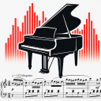
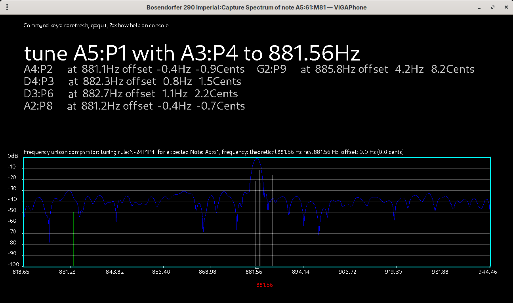
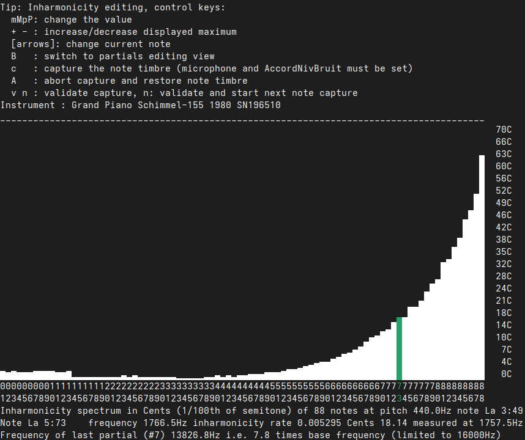
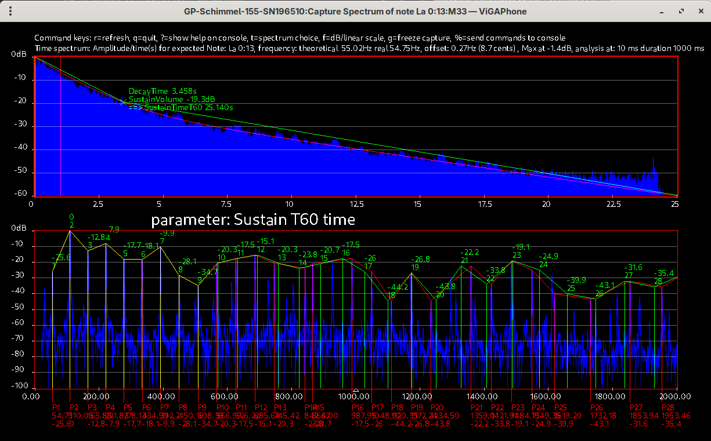

# ViGAPhone Synth Lab: New Physical‑Modeling, Timbre Analyzer, Instrument Tuner and more...
<p align="center">
  
  
</p>

<div align="center">

| English TOC | Français TDM |
| :--- | :--- |
| - [Short presentation](#short-presentation) <br> - [User manual](#user-manual) <br> - [Linux / Windows installation](#Installation-en) | - [Courte présentation](#courte-présentation) <br> - [Manuel utilisateur](#manuel-utilisateur) <br> - [Installation sur Linux / Windows](#Installation-fr) |

🎧 **Audio demonstration** Click to listen:  
[9 instruments played by Rosegarden on a Bosendorfer Imperial, no samples!](https://vigaworld-fr.github.io/ViGAWorld-ViGAPhone/main/audio/MichelPolnareff_LoveMe.mp3)

<p>
  <a href="https://vigaworld-fr.github.io/ViGAWorld-ViGAPhone/main/audio-demo.html" target="_blank">
    🎧 Open the audio demo in a new window
  </a>
</p>

</div>

<br clear="all" />

---


# EN ViGAWorld - ViGAPhone: because music is a world of sharing!


<p id="short-presentation"></p>


**ViGAPhone** is a realistic MIDI musical instrument synthesizer and a powerful tool for musical instrument/piano tuners and technicians.

## 🎹 Overview

- ViGAPhone is a realistic synthesis program for Linux or Windows computers, optionally used with a MIDI keyboard. It is designed for performing musicians, professional tuners, and occasional hobbyists.

If you're familiar with Pianoteq (Modartt), Ivory (Synthogy), or Kontakt (Native Instruments), you already have some insight into physical modeling or sampling-based synthesis.

ViGAPhone is based on physical modeling synthesis of string, percussion, or wind instruments, similar to Pianoteq, but with far more possibilities offered to the user. The first version was developed around the piano instrument, but it already includes everything needed to emulate other instruments to create entirely new ones.

It is already the best software in the world combining sound synthesis, spectral analysis and reproduction of instrument timbre, and assistance with electronic tuning of the piano and any instrument.

- ViGAPhone high precision any instrument and piano electronic tuner / accordeur électronique haute précision de piano et tout instrument

<a href="images/accorder-EN.png">
  
</a>

- ViGAPhone piano's inharmonicity acquisition

<a href="images/inharmonicite.png">
  
</a>

- ViGAPhone piano's timbre acquisition and modeling / Acquisition et modélisation du timbre du piano

<a href="images/captureTimbreAnalyse.png">
  
</a>


---

## 🎵 Features for Musicians

- Realistic, rich, deep, and expressive sound with touch-sensitive timbre, offering everything needed to enjoy performing or composing
- Emulate any existing instrument,  such as replicating a specific acoustic piano
- Create entirely new instruments with original sounds
- Fully customizable instrument and synthesis engine
- Share compact configuration files (just a few kilobytes) that encode the "DNA" of a concert piano
- Discover and preserve the best tuning methods for your real instrument, tailored to the style of music being played
- Request a professional tuner to apply a specific tuning with consistent results regardless of the tuner, ideal for concert halls or touring musicians

---

## 🛠️ Features for Piano Tuners, for pianos and instruments rebuilder

- Pedagogical tool for learning and validating piano tuning skills
- Train your ear to recognize harmonic partials and their ranks
- Practice tuning safely without risk to real instruments
- Analyze and replicate the characteristics of an acoustic piano, including inharmonicity
- Define the tuning method in a few lines using a simple grammar that establishes relationships between notes that is the temperament
- Tune the piano and any musical instrument either visually or by ear
- Propose and test multiple tunings in real-time before applying them to the actual instrument
- Use perfect unison with ViGAPhone’s output to tune real instruments quickly and precisely
- Perform spectral analysis to detect unwanted resonances or harmonization issues

---

## ⚙️ How It Works
ViGAPhone features a powerful spectral and temporal analysis engine that captures the unique timbre and envelope of an instrument. These characteristics are used to define the parameters of a physical modeling engine, which recreates the instrument’s sound using wave generators and real-time synthesis.

Because the physical behavior of entire instrument families is already modeled, ViGAPhone can analyze the individual sonic fingerprint of any real instrument. Musicians can then tweak or transform these parameters freely — to faithfully reproduce an existing instrument or craft entirely new ones with unmatched sonic depth.

The envelope control is based on the classic ADSR model (Attack, Decay, Sustain, Release), enhanced by a physical model that naturally shapes the sound curve according to each phase of the note’s life.

Even complex instruments like the piano are broken down into simple, intuitive parameters per note. Musicians can explore and adjust these settings with ease, thanks to a clear graphical interface and instant audio feedback — making sound design feel natural and effortless.

But sound alone isn’t enough. To fully integrate an instrument into a solo or orchestral context, its intonation and temperament must also be precisely controlled. ViGAPhone introduces a simple musical grammar that lets you define even the most complex temperaments in just a few words — giving you full control over how your instrument is tuned and how it blends with others.

ViGAPhone also features a tuning assistant module for real acoustic instruments. It accounts for each instrument’s inharmonicity, delivering high-precision tuning that achieves a perfect result faster than traditional ear-based tuning — especially in the extreme registers, where pitch perception is more challenging.

Creations made with ViGAPhone can be saved, archived, and shared, ensuring the preservation of real or imagined instruments and the musical works they inspire.

### Some key features:
- MIDI plug n play
- High-resolution MIDI velocity is fully supported, offering greater precision and nuance in the musician’s performance. Note-off velocity is also handled, allowing for expressive control over associated sound effects and release dynamics
- A keyboard-driven text interface: streamlined and highly efficient, ideal for professionals
- A graphical interface for real-time sound analysis, timbre reproduction, and ultra-precise piano or any instrument tuning
- An extremely compact executable size—where design quality and code efficiency truly matter
- runing on Linux with jack/alsa as on Windows10 and more
- The audio engine is exceptionally powerful—arguably the most efficient in the world. It can run on computers that are 15 years old and handle tens of thousands of waves in real time without overloading the system. It performs pure additive synthesis using sine waves, or blends them with complex computed or sampled waveforms, offering infinite creative possibilities and an extreme sonic richness.

---

## 🔐 Licensing

ViGAPhone is distributed as a binary-only application. No source code is provided.

Use of the ViGAPhone software in a professional context requires obtaining an individual license from [https://vigaworld.com](https://vigaworld.com). Each license is linked to a registered user and and his operating system. Redistribution, reverse engineering, or modification is strictly prohibited.

---

## 📫 Contact

For licensing or support inquiries:

- Website: [https://vigaworld.com](https://vigaworld.com)
- Email: [contactnotcopythis@vigaworld.com]


<p id="user-manual"></p>

## User manual

[read the user manual in English or other language via Google Translate](https://translate.google.com/translate?hl=en&sl=fr&tl=en&u=https://vigaworld-fr.github.io/ViGAWorld-ViGAPhone/main/MANUEL-UTILISATEUR.html)

<p id="Installation-en"></p>

## 🛠️ Linux / Windows Installation

### 🐧 Linux (Ubuntu Debian / ArchLinux / ChromeOS / etc.)

● **Hardware Requirements:** x64 platform amd/intel PCs, Chromebooks etc, **AVX** support.  
● **OS Requirements:** Any distribution compatible with **X11**, **OpenGL**, using **GNOME** or equivalent.  
● **Manual Download and Installation, without admin/root rights:** ● Go to the [GitHub Releases](https://github.com/ViGAWorld-FR/ViGAWorld-ViGAPhone/releases) page.  
    ● Download the package: `ViGAPhoneR_linux.tar.gz`.  
    ● Extract the archive.  
    ● Navigate to the `installOnLinuxUser` directory.  
    ● Run the shell script: ```bash ./install.sh```  

● **Installation on Arch Linux and derivatives:** ● Install the package: `AUR/vigaphone-bin` from your AUR packages manager.  

● **Installation on Ubuntu/DEBIAN/ChromeOS and derivatives:** ● download the file package: `vigaphone-bin_amd64.deb`  
    ● Install it with your packages manager or with the apt command : ```sudo apt install ./vigaphone-bin_amd64.deb```  


---

### 🪟 Windows

● **Hardware Requirements:** x64 platform, **AVX** support.  
● **OS Requirements:** Windows 10 or higher with a basic graphics card supporting **OpenGL**.  
● **Download and Installation:** ● Go to the [GitHub Releases](https://github.com/ViGAWorld-FR/ViGAWorld-ViGAPhone/releases) page.  
    ● Download the installer and run it, without admin rights: `ViGAPhone-setup_amd64.exe`.  

---

### 🌐 Language Selection

The application supports at least **English** and **French**, and can be translated into any language using the standard tool [Poedit](https://poedit.net/).  

● **Default Behavior:** The application uses the OS language. If the language is not supported, it defaults to English.  
● **Manual Configuration:** Users can also choose the language in the application settings file using the `SetLocale` variable (refer to the user manual).

----------------------------------------------------------------------------------------------------------------------

<p id="vigaphone-fr"></p>
<p id="courte-présentation"></p>

# FR ViGAWorld - ViGAPhone Synth Lab : parce que la musique est un monde de partage !

**ViGAPhone** est un synthétiseur MIDI d'instruments de musique réaliste, un analyseur du timbre sonore et un outil pour les accordeurs réparateurs de pianos et autres instruments de musique.

## 🎹  Tout sur le ViGAPhone:
- Un synthétiseur réaliste extraordinaire pour les musiciens interprètes et créatifs, un outil révolutionnaire et indispensable pour les accordeurs de pianos et autres.

Je mets à votre disposition mon programme de synthèse réaliste: le ViGAPhone, pour ordinateur Linux ou Windows optionnellement accompagné d'un clavier MIDI. Il devrait intéresser un maximum de personnes car il est fait pour les musiciens, les accordeurs professionnels ou amateurs occasionnels. Si vous connaissez Pianoteq de Modartt ou Ivory de Synthogy ou Kontakt de Native-Instrument ou etc, vous connaissez déjà un peu le sujet de la synthèse par modèle physique ou par sampling.

ViGAPhone est basé sur la synthèse par modèle physique des instruments à cordes à percussion ou à vent, comme  Pianoteq, mais avec beaucoup plus de possibilités offertes à l'utilisateur. La première version a été développée autour de l'instrument Piano, mais elle possède déjà tout ce qu'il faut pour imiter d'autres instruments ou en créer de nouveaux.

Il est déjà le meilleur logiciel au monde rassemblant la synthèse sonore, l'analyse et la reproduction spectrale du timbre des instruments, et l'assistance à l'accordage électronique du piano et de tout instrument.

- ViGAPhone : accordeur électronique haute précision de piano et tout instrument

<a href="images/accorder-EN.png">
  
</a>

- ViGAPhone : capture et analyse de l'inharmonicité d'un piano

<a href="images/inharmonicite.png">
  
</a>

- ViGAPhone : acquisition et modélisation du timbre du piano

<a href="images/captureTimbreAnalyse.png">
  
</a>


- Voici les services qu'offre le ViGAPhone :
## 🎵 Pour les musiciens
- jouer avec un son réaliste, riche, profond, unique, un timbre sensible au toucher, tout ce qu'il faut pour prendre plaisir à jouer ou à composer
- imiter n'importe quel instrument existant, comme de copier un piano acoustique particulier
- créer de nouveaux instruments avec des nouveaux sons
- avoir un instrument entièrement paramétrable
- échanger et partager les fichiers de paramétrages dont la taille fait quelques kilos octets pour contenir l'équivalent de l'ADN d'un piano de concert par exemple
- trouver et conserver les meilleures façons d'accorder son instrument réel en fonction du style de musique jouée,
- demander à un accordeur professionnel de réaliser un accord particulier avec un résulat constant quel que soit l'accordeur, idéal pour les salles de concert ou les musiciens itinérants

## 🛠️ Pour les accordeurs professionnels ou occasionnels, pour les facteurs d'instruments musicaux
- un outil pédagogique pour apprendre à accorder un piano, contrôler le résultat, valider les capacités d'un apprenti
- former l'oreille à différentier les partiels et leurs rangs
- s'entraîner à l'accordage sans risque pour l'instrument réel
- définir la méthode d'accordage en quelques lignes grâce à une grammaire simple établissant les relations entre les notes appelée tempérament
- accorder le piano et tout instrument de musique visuellement ou à l'oreille
- reprendre les caractéristiques d'un piano acoustique, étudier ou chercher la meilleure façon d'accorder ce piano particulier avec son inharmonicité spécifique, proposer différents accordages instantanément et les tester en réel avec d'autres instruments avant de réaliser celui retenu par le musicien ; utiliser le résultat pour accorder rapidement et facilement l'instrument, simplement grâce à l'unisson parfait avec le son produit par le ViGAPhone
- étudier l'analyse spectrale et la répartition des partiels pour trouver les vibrations parasites ou les défauts d'harmonisation

## ⚙️ Principe de fonctionnement
L’application ViGAPhone intègre un module d’analyse spectrale du timbre et une analyse temporelle de l’enveloppe sonore, permettant de définir les paramètres du modèle physique qui reproduit le son de l’instrument via son moteur audio et ses générateurs d’ondes.

Grâce à une modélisation précise du fonctionnement acoustique d’un groupe d’instruments, ViGAPhone analyse les caractéristiques sonores de chaque instrument réel — timbre, dynamique, évolution — et les rend accessibles et modifiables par le musicien. On peut ainsi reproduire fidèlement un instrument existant ou en imaginer de nouveaux, avec une richesse sonore inédite.

Le contrôle de l’enveloppe sonore repose sur le modèle ADSR, qui décrit les quatre phases de vie d’une note (Attack, Decay, Sustain, Release), couplé à une modélisation physique qui calcule la courbe naturelle du son selon ces états.

Même les instruments complexes comme le piano sont décomposés en paramètres simples et intuitifs, note par note. Le musicien peut les explorer, les ajuster et les écouter en temps réel, grâce à une interface graphique claire et une réponse sonore immédiate, pour une approche naturelle et sans effort.

L'imitation sonore d'un instrument de musique n'est pas suffisante, il faut aussi contrôler son tempérament afin de l'inscrire pleinement dans la production musicale en soliste ou en orchestre. L’application ViGAPhone propose une grammaire simple pour définir en quelques mots un tempérament complexe permettant d'accorder un instrument selon le contexte musical.

L’application ViGAPhone intègre un module d’assistance à l’accordage d’instruments acoustiques, prenant en compte leur inharmonicité naturelle. Grâce à une précision élevée, elle permet d’obtenir un accord parfait plus rapidement qu’un accordage entièrement réalisé à l’oreille — en particulier dans les notes extrêmes, souvent difficiles à percevoir avec fiabilité.

Les instruments créés avec ViGAPhone peuvent être enregistrés, archivés et partagés, assurant la pérennité des sonorités réelles ou synthétiques, et des œuvres musicales qui les utilisent.

### Quelques points clés:
- MIDI plug n play.
- La vélocité MIDI haute résolution est gérée pour une meilleure précision du jeu du musicien, ainsi que la vélocité du noteOff pour gérer les effets sonores associés.
- la vélocité MIDI haute résolution est prise en charge, offrant une précision accrue dans le jeu et une meilleure restitution des nuances d’interprétation. La vélocité du note-off est également gérée, permettant de contrôler finement les effets sonores liés à la fin de note, comme les résonances, les relâchements ou les transitions expressives.
- Une interface texte entièrement commandée au clavier, sans fioritures et parfaitement efficace, idéale pour les professionnels.
- Une interface graphique pour l'analyse sonore en temps réel, la reproduction du timbre d'un instrument ou l'accordage d'un piano avec une précision inégalée. A vos claviers!
- Une taille de fichier exécutable du programme extrêmement réduite, ici c'est la qualité de la conception et du code qui pèse lourd.
- fonctionne sur Linux jack/alsa ou sur Windows10 et plus.
- Le moteur audio est extrêmement performant, sans doute le plus performant au monde. Il peut fonctionner sur des ordinateurs de 15 ans d'âge et gérer plusieurs dizaines de milliers d'ondes en temps réel sans saturer le système. Il fait de la synthèse additive pure avec des ondes sinusoïdales, ou mixer avec des ondes complexes calculées ou échantillonnées offrant une infinité de possibilités et une richesse sonore extrême.

## 🔐 Licence

ViGAPhone est distribué uniquement sous forme binaire. Aucun accès au code source n’est fourni.

L’utilisation du logiciel ViGAPhone dans un cadre professionnel nécessite l’obtention d’une licence individuelle via [https://vigaworld.com](https://vigaworld.com). Chaque licence est liée à un utilisateur enregistré et à son système d'exploitation.

## 📫 Contact

For licensing or support inquiries:

- Website: [https://vigaworld.com](https://vigaworld.com)
- Email: [contactnotcopythis@vigaworld.com]


Toute redistribution, ingénierie inverse ou modification est strictement interdite.

<p id="manuel-utilisateur"></p>

## Manuel utilisateur

[Lire le manuel utilisateur](https://vigaworld-fr.github.io/ViGAWorld-ViGAPhone/main/MANUEL-UTILISATEUR.html)

<p id="Installation-fr"></p>

## 🛠️ Installation Linux / Windows

### 🐧 Linux (Ubuntu Debian / ArchLinux / ChromeOS / etc.)

● **Prérequis matériel :** Plateforme x64 amd/intel PCs, Chromebooks etc, support **AVX**.  
● **Prérequis OS :** Toute distribution compatible **X11**, **OpenGL**, avec **GNOME** ou équivalent.  
● **Téléchargement et installation manuelle, sans droits admin/root :** ● Rendez-vous sur la page des [Releases GitHub](https://github.com/ViGAWorld-FR/ViGAWorld-ViGAPhone/releases).  
    ● Téléchargez l'archive : `ViGAPhoneR_linux.tar.gz`.  
    ● Dézippez l'archive.  
    ● Allez dans le répertoire `installOnLinuxUser`.  
    ● Lancez le script d'installation : ```bash ./install.sh```

● **Installation sur Arch Linux et dérivés :** ● Installez le paquet : `AUR/vigaphone-bin` depuis votre gestionnaire de paquets AUR.  

● **Installation sur Ubuntu/DEBIAN/ChromeOS et dérivés:** ● télécharger le fichier package: `vigaphone-bin_amd64.deb`  
    ● L'installer avec le gestionnaire de paquets ou la commande apt : ```sudo apt install ./vigaphone-bin_amd64.deb```  


---

### 🪟 Windows

● **Prérequis matériel :** Plateforme x64, support **AVX**.  
● **Prérequis OS :** Windows 10 ou supérieur avec une carte graphique supportant **OpenGL**.  
● **Téléchargement et installation, sans droits admin :** ● Rendez-vous sur la page des [Releases GitHub](https://github.com/ViGAWorld-FR/ViGAWorld-ViGAPhone/releases).  
    ● Téléchargez et exécutez l'auto-installateur : `ViGAPhone-setup_amd64.exe`.  


---

### 🌐 Choix de la langue d'affichage

L'application supporte au minimum l'**anglais** et le **français**, et peut être traduite dans toutes les langues avec l'outil standard [Poedit](https://poedit.net/).  

● **Comportement par défaut :** L'application utilise la langue du système d'exploitation. Si celle-ci n'est pas supportée, elle bascule automatiquement en anglais.  
● **Configuration manuelle :** L'utilisateur peut forcer la langue dans le fichier de configuration via la variable `SetLocale` (voir le manuel utilisateur).

<a href="http://www.mon-compteur.fr"></a>

